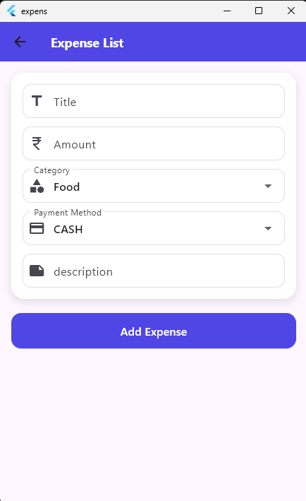
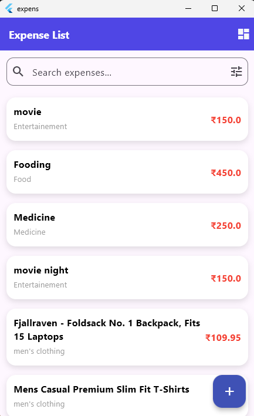
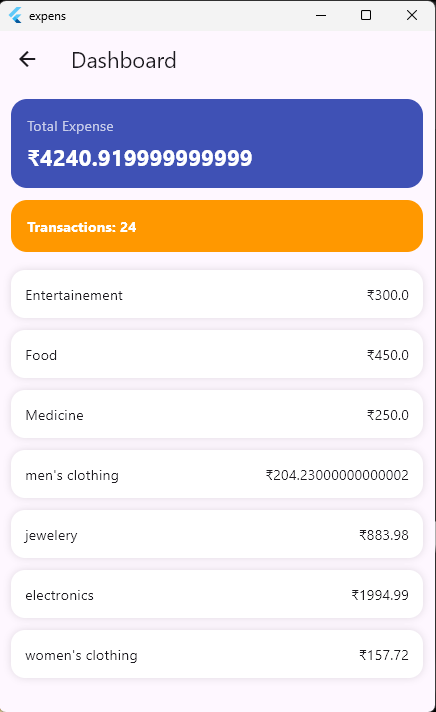

# Expense Tracker App

A Flutter-based expense tracking application with clean UI and Provider state management.

## Features
- Add expenses
- Expense listing
- Search and filtering
- Dashboard analytics
- Category-wise expense summary
- REST API integration
- Clean responsive UI

## Tech Stack
- Flutter
- Provider
- REST API
- MVC architecture

## Screenshots

## Author
Ranjith K Madhavan
